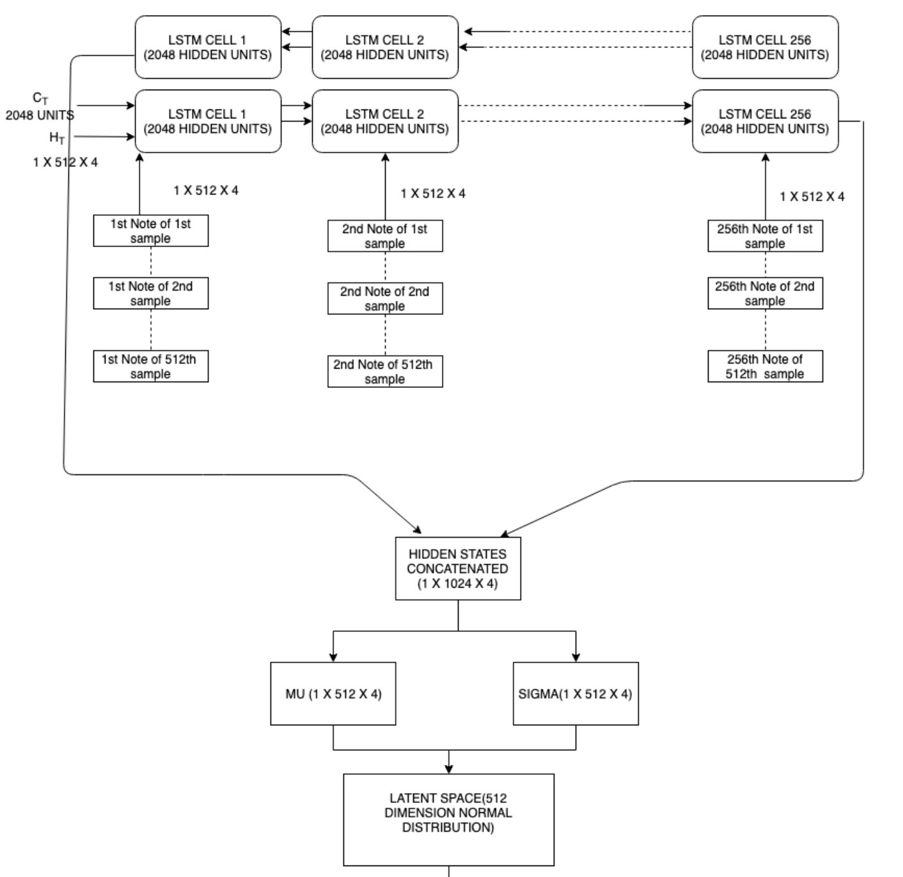

# Music VAE 모델 구현 과정

## 훈련용 데이터셋 구현

데이터 셋 관련 코드는

- [musicvae/data_utils.py](musicvae/data_utils.py)
- [musicvae/music_utils.py](musicvae/music_utils.py)
- [data_preprocess.ipynb](./data_preprocess.ipynb)

에 있습니다

MIDI 데이터는 instruments와 해당 instruments의 note의 **pitch 정보** 및 해당 note의 **시작 시간**과 **끝나는 시간** 그리고 **크기** 가 존재합니다

사용되는 pitch는 [Groove Dataset](https://magenta.tensorflow.org/datasets/groove)을 참고하여 총 9개로 categorize 하였습니다

각 note list를 drum instruments로 부터 추출하여 특정 time interval에서 어떤 pitch가 있었는지 총 9개의 array를 만들어 추적하였습니다

예를 들어, 만약 첫번째 time slot이 0.1초와 0.2초 사이라고 하였을 때, 이 time slot 내에 재생이 된 note들의 pitch를 array로 추적하는 방식입니다

총 9개의 pitch가 있으므로 [0, 0, 0, 0, 0, 0, 0, 0 0]가 각 time slot 별로 존재하고 여기서 연주가 된 pitch는 1로 바꾸어줍니다

이 정보를 또 다시 one hot encoding으로 바꾸는데, 이는 같은 time slot에 동시에 연주한 악기가 있을 수 있기 때문입니다 [0, 0, 0, 1, 0, 0, 0, 0, 1] 같이 한 time slot에 세개의 악기가 연주 될 수 있기 때문에 이는 one hot encoding이 아닙니다

따라서 이를 one hot encoding을 하기 위해 해당 array를 binary array로 본 후, decimal 값을 계산하여 이 값을 one hot encoding을 하였습니다

이 때, 필요한 one hot encoding vector의 크기는 2^9 = 512 며, 위의 array는 1 *2^5 + 1* 2^0 = 33 이 되어 one hot encoding vector의 33번째 index가 1이 됩니다

이러한 방식을 통해 Train, Validate, Test 데이터 셋을 만들었습니다

## 모델 구현

모델 코드는 [musicvae/layers.py](musicvae/layers.py)에 있습니다

크게 모델을 3개로 구성을 하였습니다

- Encoder
- Conductor
- Decoder

### Encoder

- Encoder는 Bidirection LSTM 모델을 활용을 하여 forward 방향과 backward 방향에서 나온 최종 output을 concatenate을 합니다
- 그 후, concatenate 한 vector를 통해 하나는 mu, 또다른 하나를 sigma를 도출합니다
- 해당 mu를 평균으로 sigma를 표준편차를 가지고 있는 Gaussian Distribution에서 vector 값을 추출하며 이것은 Conductor로 들어갑니다

### Conductor

- Conductor는 각 Bar 별로의 feature를 만들어 냅니다
- 2 Layer 방식의 forward LSTM 모델로 구성하였습니다

### Decoder

- Decoder는 Conductor에서 나온 각 Bar 별로의 feature를 활용해 Note feature를 만듭니다
- 2 Layer 방식의 forward LSTM 모델로 구성하였습니다

## 코멘트

- 논문 및 추가 자료들을 활용하여 논문 해석 및 코드를 구현하였습니다. 따라서 코드 구현 등에 오류가 있을 수 있습니다
- 컴퓨터 사양의 문제로 full training은 해보지 못하였고 일부 데이터셋만 추출하여 training을 진행하였는데, 과정에서는 큰 문제가 없었으나 모델의 예측 성능이 좋지 않다는 결론이 나왔습니다
- 시간적 여유가 주어진다면 모델의 문제 등에 착수할 수 있을 것으로 보이나 지금은 process 구현에 중점을 두었습니다

## References

- [Music VAE 논문](https://arxiv.org/pdf/1803.05428.pdf)
- [https://medium.com/@musicvaeubcse/musicvae-understanding-of-the-googles-work-for-interpolating-two-music-sequences-621dcbfa307c](https://medium.com/@musicvaeubcse/musicvae-understanding-of-the-googles-work-for-interpolating-two-music-sequences-621dcbfa307c)
- [https://github.com/yizhouzhao/MusicVAE](https://github.com/yizhouzhao/MusicVAE)
- [https://github.com/Variational-Autoencoder/MusicVAE](https://github.com/Variational-Autoencoder/MusicVAE)
- [https://github.com/sjhan91/MusicVAE](https://github.com/sjhan91/MusicVAE)
